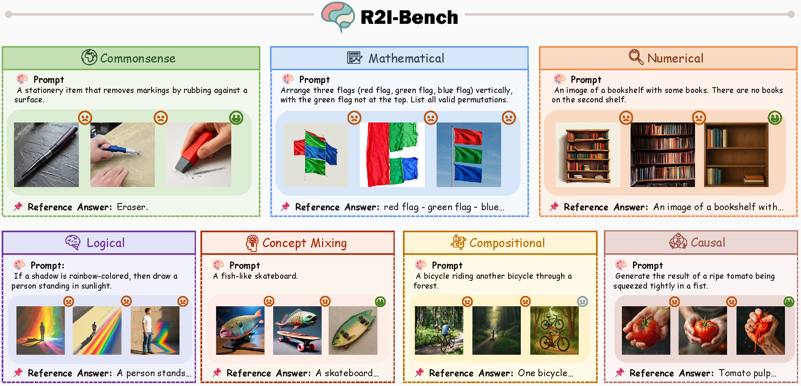

# 🧠 R2I-Bench: Benchmarking Reasoning-Driven Text-to-Image Generation

> Official repository for the paper:
> ⭐️ [**R2I-Bench: Benchmarking Reasoning-Driven Text-to-Image Generation**](https://arxiv.org/abs/2505.23493)🌟

---

## 🌈 Overview: Reasoning in Image Generation

We introduce Logo R2I-Bench , a comprehensive benchmark designed to assess the reasoning capabilities of text-to-image (T2I) generation models.

<div align="center">
  
</div>

---

## 🚀 Get Started

### 📦 Installation

Clone the repository:

```bash
git clone https://github.com/PLUM-Lab/R2I-Bench
cd R2I-Bench
```

> 💡 Make sure you have Python ≥ 3.8 and install dependencies listed in `requirements.txt`.

---

### 🖼️ Generation

Run the generation script:

```bash
python generation.py
```

This will produce model-generated images based on reasoning-oriented prompts.

---

### 📊 Evaluation

To evaluate generated results:

```bash
python evaluation.py
```


---

## 📌 Citation

If you find this repository helpful in your research or applications, please consider citing:🌞

```bibtex
@misc{chen2025r2ibenchbenchmarkingreasoningdriventexttoimage,
  title={R2I-Bench: Benchmarking Reasoning-Driven Text-to-Image Generation}, 
  author={Kaijie Chen and Zihao Lin and Zhiyang Xu and Ying Shen and Yuguang Yao and Joy Rimchala and Jiaxin Zhang and Lifu Huang},
  year={2025},
  eprint={2505.23493},
  archivePrefix={arXiv},
  primaryClass={cs.CV},
  url={https://arxiv.org/abs/2505.23493}
}
```
